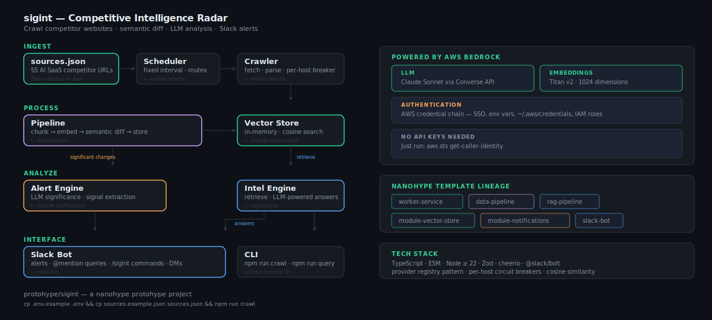

# sigint

Competitive intelligence radar — detect signals before they become headlines.

sigint crawls competitor websites on a schedule, embeds and stores the content, performs semantic diffs against previous snapshots, and alerts you in Slack when something meaningful changes. Query it anytime with natural language.

## Architecture



## nanohype Template Lineage

This project composes patterns from these nanohype templates:

| Subsystem | Template Origin | What It Provides |
|-----------|----------------|------------------|
| Crawler | `worker-service` | Scheduled job execution, circuit breaker, graceful shutdown |
| Pipeline | `data-pipeline` | Document chunking, embedding generation, orchestration |
| Vector Store | `module-vector-store` | Provider registry, cosine similarity, in-memory store |
| Intel Engine | `rag-pipeline` | Retrieval + generation with source citations |
| Alerts | `module-notifications` | Multi-channel dispatch, message formatting |
| Slack Bot | `slack-bot` | Bolt app, event handlers, slash commands |
| Providers | (all templates) | Self-registering provider registry pattern |
| Resilience | (all templates) | Circuit breaker (threshold-based, per-host for HTTP) |

## Prerequisites

sigint is powered by **AWS Bedrock** — Claude Sonnet for LLM analysis and Titan v2 for embeddings. No API keys needed. It uses the standard AWS credential chain.

**1. Install the AWS CLI** (if you don't have it):

```bash
brew install awscli          # macOS
# or: https://aws.amazon.com/cli/
```

**2. Authenticate:**

```bash
# Option A: SSO (recommended for orgs)
aws sso login --profile your-profile

# Option B: Access keys
aws configure
# Enter your AWS Access Key ID, Secret Access Key, and region (us-east-1)
```

**3. Verify:**

```bash
aws sts get-caller-identity
# Should print your account/ARN — if this works, sigint will work
```

**4. Bedrock model access:** Ensure your AWS account has access to `anthropic.claude-sonnet-4-20250514-v1:0` and `amazon.titan-embed-text-v2:0` in your region. Check [Bedrock model access](https://console.aws.amazon.com/bedrock/home#/modelaccess) in the AWS console.

## Quick Start

```bash
# 1. Install
npm install

# 2. Configure
cp .env.example .env
# Defaults to Bedrock — no keys to set, just be authenticated with AWS

# 3. Define sources
cp sources.example.json sources.json
# Includes 55 AI SaaS competitor sources across 30 companies

# 4. Run a one-off crawl (no Slack required)
npm run crawl

# 5. Query the knowledge base
npm run query -- "Who is launching new AI features?"

# 6. Start the full system (scheduler + Slack bot)
npm run dev
```

### Production Build

```bash
npm run build        # Compile TypeScript to dist/
npm start            # Run compiled output
```

## Configuration

### LLM & Embedding Providers

sigint defaults to **AWS Bedrock** for both LLM (Claude via Converse API) and embeddings (Titan v2). No API keys needed — it uses the standard AWS credential chain (env vars, `~/.aws/credentials`, SSO, IAM roles).

To use direct API providers instead, set `LLM_PROVIDER` and/or `EMBEDDING_PROVIDER` and their API keys.

### Environment Variables

| Variable | Default | Description |
|----------|---------|-------------|
| `LLM_PROVIDER` | `bedrock` | LLM provider (`bedrock`, `anthropic`, or `openai`) |
| `EMBEDDING_PROVIDER` | `bedrock` | Embedding provider (`bedrock` or `openai`) |
| `AWS_REGION` | `us-east-1` | AWS region for Bedrock |
| `BEDROCK_LLM_MODEL` | `us.anthropic.claude-sonnet-4-20250514-v1:0` | Bedrock LLM model ID |
| `BEDROCK_EMBEDDING_MODEL` | `amazon.titan-embed-text-v2:0` | Bedrock embedding model ID |
| `ANTHROPIC_API_KEY` | — | Required only if `LLM_PROVIDER=anthropic` |
| `OPENAI_API_KEY` | — | Required only if using `openai` for LLM or embeddings |
| `EMBEDDING_DIMENSIONS` | `1024` | Embedding vector dimensions (1024 for Titan, 1536 for OpenAI) |
| `VECTOR_PROVIDER` | `memory` | Vector store backend (only `memory` currently) |
| `CRAWL_INTERVAL_MINUTES` | `60` | Minutes between scheduled crawls |
| `CRAWL_TIMEOUT_MS` | `30000` | HTTP timeout per page fetch |
| `USER_AGENT` | `sigint/0.1.0` | HTTP User-Agent header for crawl requests |
| `SIGNIFICANCE_THRESHOLD` | `0.3` | 0–1, minimum semantic change to trigger alert |
| `SLACK_BOT_TOKEN` | — | Slack bot token (`xoxb-...`) |
| `SLACK_SIGNING_SECRET` | — | Slack app signing secret |
| `SLACK_APP_TOKEN` | — | Slack app-level token for Socket Mode (`xapp-...`) |
| `SLACK_ALERT_CHANNEL` | `#competitive-intel` | Channel for automated alerts |
| `LOG_LEVEL` | `info` | Log verbosity (`debug`, `info`, `warn`, `error`) |
| `PORT` | `3000` | HTTP server port (used in non-Socket Mode) |
| `NODE_ENV` | `development` | Runtime environment |

> **Vector store note:** The `memory` provider loses all data when the process restarts. Each session starts fresh.

### Source Configuration

Create `sources.json` with competitor URLs to monitor. The included `sources.example.json` has 55 sources across 30 AI SaaS companies (Cursor, Replit, Lovable, Jasper, Writer, Runway, ElevenLabs, and more):

```bash
cp sources.example.json sources.json
```

Each source entry:

```json
{
  "id": "aws:whats-new",
  "competitor": "aws",
  "url": "https://aws.amazon.com/new/",
  "type": "changelog",
  "selectors": {
    "content": "main",
    "exclude": ["nav", "footer", "#aws-page-header"]
  }
}
```

**Source types:** `changelog`, `blog`, `pricing`, `careers`, `docs`, `general`

**Selectors** (optional):
- `content` — CSS selector for the main content area (defaults to `body`)
- `exclude` — CSS selectors to strip before parsing (nav, footer, ads)

**Important notes:**
- Sources are validated with Zod on load — malformed `sources.json` will fail fast with a clear error.
- sigint uses a static HTML fetcher. Pages that render content entirely via JavaScript (SPAs) will return empty or minimal content. Most cloud provider pages listed in the example serve server-rendered HTML.
- CSS selectors are tied to each site's current markup. When a competitor redesigns their site, selectors may need updating.

## Slack Setup

Slack integration is optional — the CLI (`npm run crawl`, `npm run query`) works without it.

To enable Slack:

1. Create a Slack app at [api.slack.com/apps](https://api.slack.com/apps)
2. Under **OAuth & Permissions**, add these bot scopes:
   - `app_mentions:read` — respond to @mentions
   - `chat:write` — post alerts and answers
   - `commands` — handle `/sigint` slash commands
   - `im:history`, `im:read`, `im:write` — respond to DMs
3. Under **Event Subscriptions**, subscribe to:
   - `app_mention`
   - `message.im`
4. Under **Slash Commands**, create:
   - Command: `/sigint`
   - Request URL: your server URL + `/slack/events` (or use Socket Mode)
5. Under **App-Level Tokens** (for Socket Mode), generate a token with `connections:write` scope
6. Install the app to your workspace, then set env vars:
   - `SLACK_BOT_TOKEN` — Bot User OAuth Token (`xoxb-...`)
   - `SLACK_SIGNING_SECRET` — from Basic Information page
   - `SLACK_APP_TOKEN` — App-Level Token (`xapp-...`, enables Socket Mode)

**Socket Mode vs HTTP:** If `SLACK_APP_TOKEN` is set, sigint uses Socket Mode (no public URL needed — great for development). Without it, the bot listens for HTTP events on `PORT`.

## Slack Commands

| Command | Description |
|---------|-------------|
| `/sigint query <question>` | Ask about competitors |
| `/sigint crawl` | Trigger an immediate crawl |
| `/sigint status` | Show system uptime and health |
| `@sigint <question>` | Ask via @mention in any channel |

## How It Works

### Cold Start

On the very first crawl, the vector store is empty. Every chunk is "new," so the change score is 1.0 for all sources. This triggers alerts for everything. This is expected behavior — the first run establishes the baseline.

To avoid a flood of alerts on first run, either:
- Run `npm run crawl` (CLI mode, no Slack alerts) before starting the full system
- Or temporarily set `SIGNIFICANCE_THRESHOLD=1.1` for the initial run

### Semantic Diffing

sigint doesn't do naive text comparison. Each crawl:

1. **Chunks** the page content using recursive text splitting
2. **Embeds** each chunk via the configured embedding provider (Bedrock Titan or OpenAI)
3. **Compares** each new embedding against stored embeddings for the same source
4. Chunks with cosine similarity below 0.85 to any stored chunk are flagged as **new**
5. The **change score** (new chunks / total chunks) determines significance
6. Changes above the threshold trigger LLM analysis and Slack alerts

This means reformatting, reordering, or minor typo fixes won't trigger false alerts — only semantically meaningful changes do.

### Alert Significance

The LLM analyzes each significant change and assigns a level:

- **Critical** — Pricing changes, major product launches, acquisitions
- **High** — New features, API changes, large hiring pushes
- **Medium** — Blog posts, minor feature updates, team changes
- **Low** — Content updates, documentation changes

## Project Structure

```
src/
├── index.ts              # Entry point — wires everything, starts scheduler + bot
├── cli.ts                # CLI for one-off crawl and query commands
├── config.ts             # Zod-validated configuration from env vars
├── logger.ts             # Structured JSON logging
├── providers/
│   ├── registry.ts       # Generic typed provider registry factory
│   ├── llm.ts            # Bedrock, Anthropic, and OpenAI LLM providers
│   ├── embeddings.ts     # Bedrock Titan and OpenAI embedding providers
│   └── vectors.ts        # In-memory vector store (cosine similarity)
├── crawler/
│   ├── index.ts          # Crawl orchestrator (sequential, fault-tolerant)
│   ├── sources.ts        # Source config types + Zod-validated loader
│   ├── fetcher.ts        # HTTP fetcher with per-host circuit breaker
│   └── parser.ts         # HTML → structured content (cheerio)
├── pipeline/
│   ├── index.ts          # Ingest orchestrator: chunk → embed → diff → store
│   ├── chunker.ts        # Recursive text splitter with overlap
│   └── differ.ts         # Semantic diff engine
├── intel/
│   ├── index.ts          # Query facade (embed → retrieve → answer)
│   └── analysis.ts       # LLM-powered change analysis + query answering
├── alerts/
│   ├── index.ts          # Alert engine (threshold gating + dispatch)
│   └── formatter.ts      # Slack Block Kit message formatting
├── slack/
│   ├── index.ts          # Bolt app setup + alert sink
│   ├── handlers.ts       # @mention and DM event handlers
│   └── commands.ts       # /sigint slash commands
├── scheduler/
│   └── index.ts          # Interval-based job scheduler
└── resilience/
    └── circuit-breaker.ts  # Threshold-based circuit breaker
```

## License

Apache-2.0
